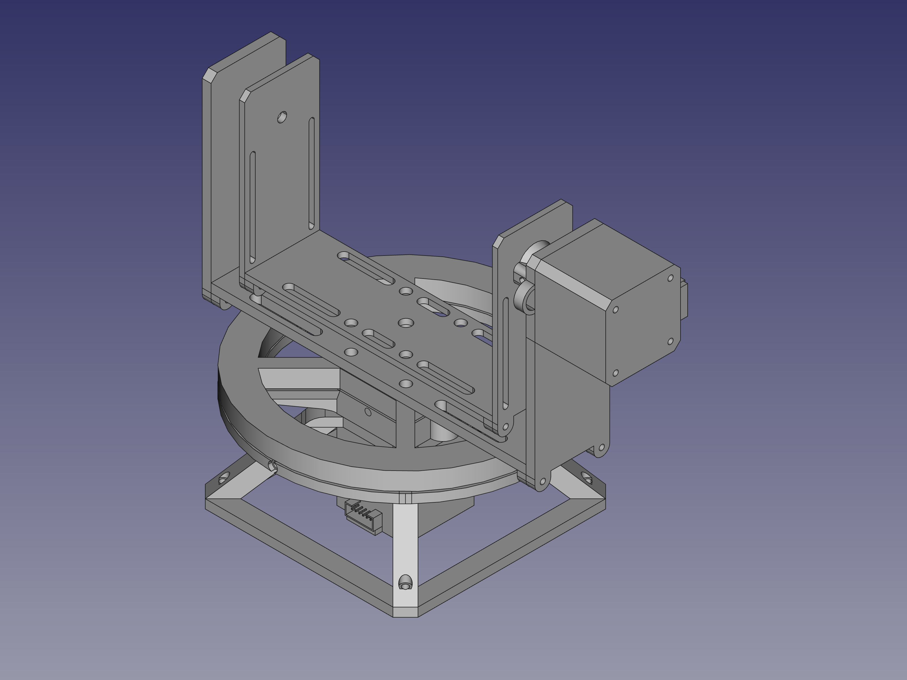
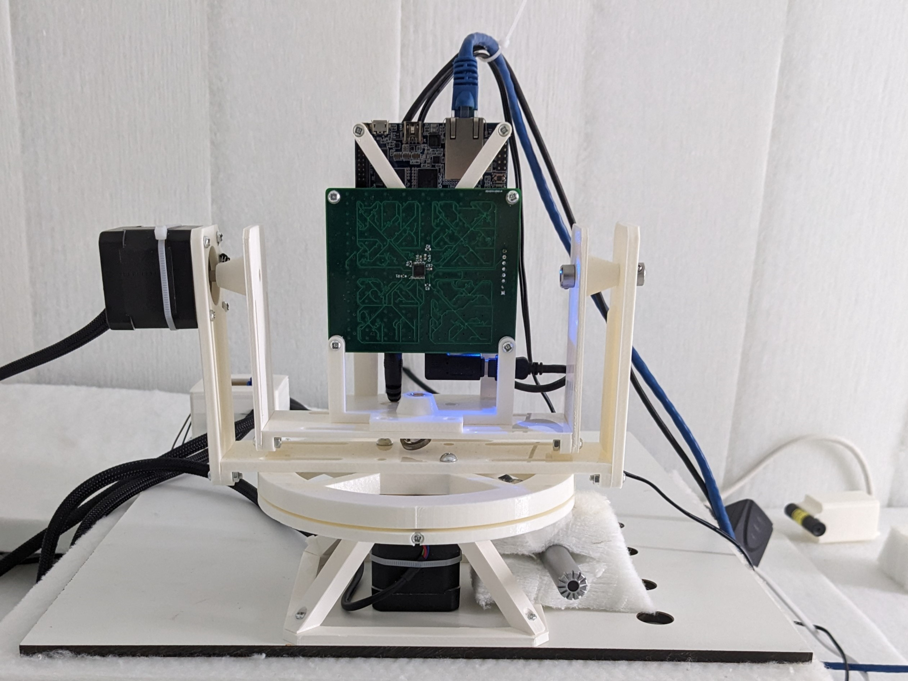

# Two-Axis Rotation Table

Welcome to the Two-Axis Rotation Table project! This open-source project focuses on the development of a versatile rotation system, featuring azimuth and elevation axes. The table is driven by two powerful NEMA-17 motors, providing precise control and flexibility for various applications.

    
     
    Left: The CAD model of the Two-Axis Rotation Table. Right: The assembeld table with a microphone array on the experiment carrier.

Other names: Rotational Actuator, Pan-and-Tilt Rotational Stage, Elevation-Azimuth Positioner.

## Key Features

- **Dual Axes:** The rotation table boasts two axes – azimuth and elevation, allowing for multidimensional positioning.
- **NEMA-17 Motors:** Powered by robust NEMA-17 stepper motors, ensuring reliable and accurate rotation.
- **Magnetic Referencing:** Accurate axis referencing is achieved through the use of magnets and Hall sensors, providing a reliable and repeatable starting point.
- **Arduino MCU and CNC Shield:** The electronics are built upon the Arduino R4 Minima microcontroller unit (MCU) and a CNC shield, offering a user-friendly and customizable platform for control.

## Use Cases

This rotation table is ideal for various applications, including:

### Antenna Measurement

Achieve precise orientation for antenna measurements, enabling accurate testing and characterization of radiation patterns.

### Microphone Array Measurements

Optimize the positioning of microphone arrays for audio capture, facilitating the study of sound localization and enhancing beamforming performance.

## Getting Started

To get started with your own rotation table, check out the documentation in the `design-files` directory. There you'll find the FreeCAD design files which can be exported to .stl files for 3-D printing. The project is split into three larger components:

1. The azimuth rotation stage (`design-files/azimuth-rotation-table.FCStd`)
2. the elevation rotation stage (`design-files/elevation-rotation-table.FCStd`)
3. the housing for the arduino (`design-files/electronics-housing.FCStd`)

Ech file consists of serveral parts, which can be serperately exported and printed.

## Repository Structure

- `/docs`: Detailed documentation on assembly, wiring, and programming.
- `/design-files`: CAD drawings and design files for the rotation table.
- `/src`: Arduino code for controlling the rotation table.
- `/hardware`: Schematics and board layouts for the CNC shield.

Feel free to contribute, report issues, or explore customization options. Happy rotating!

### Python Library
There exists a python library to control the rotation table. It can be found under: https://github.com/e1kable/pyrotlib .
<!--video src="docs/media/rotation-table-demo.mp4" controls title="Rotation Table Demo"></video-->

## Acknowledgement
This project was partly funded by the Federal Ministry of Economic Affais and Climate Action under grant FKZ: 03EE3066D Verbundvorhaben LoCA.